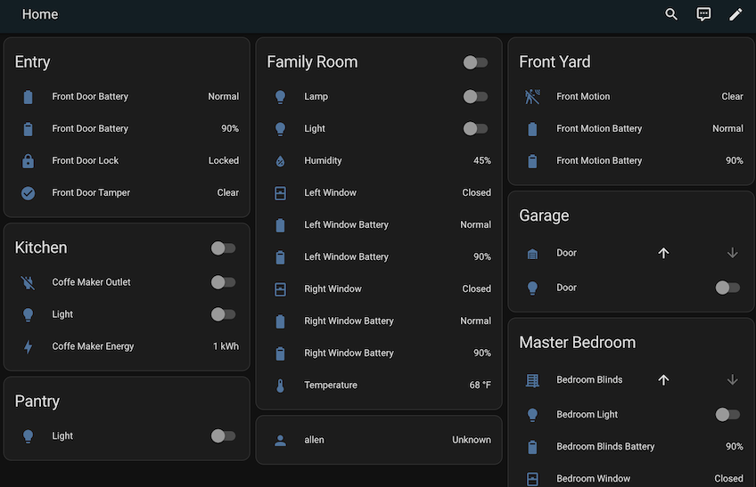

# Synthetic Home

This is Home Assistant custom component that generates a synthetic home from a
configuration file, used for testing.

## Synthetic Home Configuration

See the [synthetic home documentation](https://allenporter.github.io/synthetic-home/synthetic_home.html) for a description of the configuration
file format. This is essentially modeled after Home Assistants `demo` platform
but allows you to name devices and stick them in areas using a configuration file.

## Synthetic Home Generation

The [synthetic-home](https://allenporter.github.io/synthetic-home) library allows
you to create a home in terms of devices and then convert that into an inventory
file that contains the actual underlying entities. You can also just create the
inventory directly or generate it from an existing home-assistant instance also.

Given an example synthetic home configuration file `inventory.yaml`:

```yaml
---
areas:
  - name: Family Room
    id: family_room
  - name: Entry
    id: entry
  - name: Kitchen
    id: kitchen
  - name: Master Bedroom
    id: master_bedroom
  - name: Garage
    id: garage
  - name: Front Yard
    id: front_yard
devices:
  - name: Family Room Lamp
    id: family_room_lamp
    area: family_room
    info:
      model: Hue
      manufacturer: Phillips
  - name: Family Room
    id: family_room
    area: family_room
    info:
      manufacturer: Nest
      sw_version: 1.0.0
  - name: Left Window
    id: left_window
    area: family_room
  - name: Right Window
    id: right_window
    area: family_room
  - name: Front Door
    id: front_door
    area: entry
  - name: Light
    id: light
    area: kitchen
  - name: coffee Maker
    id: coffee_maker
    area: kitchen
    info:
      manufacturer: Shelly
  - name: Bedroom Light
    id: bedroom_light
    area: master_bedroom
  - name: Bedroom Blinds
    id: bedroom_blinds
    area: master_bedroom
    info:
      model: RollerBlinds
      manufacturer: Motion Blinds
      sw_version: 1.1.0
  - name: Bedroom Window
    id: bedroom_window
    area: master_bedroom
  - name: Garage Door
    id: garage_door
    area: garage
  - name: Front Motion
    id: front_motion
    area: front_yard
entities:
  - name: Family Room Lamp
    id: light.family_room_lamp
    area: family_room
    device: family_room_lamp
    state: "off"
    attributes:
      supported_color_modes:
        - onoff
      color_mode: onoff
  - name: Family Room
    id: climate.family_room
    area: family_room
    device: family_room
    attributes:
      unit_of_measurement: "\xB0C"
      supported_features:
        - climate.ClimateEntityFeature.FAN_MODE
        - climate.ClimateEntityFeature.TURN_ON
        - climate.ClimateEntityFeature.TURN_OFF
        - climate.ClimateEntityFeature.TARGET_TEMPERATURE_RANGE
      hvac_modes:
        - "off"
        - cool
        - heat
        - auto
      hvac_mode: "off"
      hvac_action: "off"
      current_temperature: 22
      target_temperature: 22
  - name: Family Room Temperature
    id: sensor.family_room_temperature
    area: family_room
    device: family_room
    attributes:
      native_unit_of_measurement: "\xB0C"
      device_class: sensor.SensorDeviceClass.TEMPERATURE
      state_class: sensor.SensorStateClass.MEASUREMENT
      native_value: 22
  - name: Family Room Humidity
    id: sensor.family_room_humidity
    area: family_room
    device: family_room
    attributes:
      native_unit_of_measurement: "%"
      device_class: sensor.SensorDeviceClass.HUMIDITY
      state_class: sensor.SensorStateClass.MEASUREMENT
      native_value: 45
  - name: Left Window
    id: binary_sensor.left_window
    area: family_room
    device: left_window
    state: false
    attributes:
      device_class: binary_sensor.BinarySensorDeviceClass.WINDOW
  - name: Left Window Battery
    id: binary_sensor.left_window_battery
    area: family_room
    device: left_window
    attributes:
      device_class: binary_sensor.BinarySensorDeviceClass.BATTERY
  - name: Left Window Battery
    id: sensor.left_window_battery
    area: family_room
    device: left_window
    state: "90"
    attributes:
      device_class: sensor.SensorDeviceClass.BATTERY
      state_class: sensor.SensorStateClass.MEASUREMENT
      native_unit_of_measurement: "%"
  - name: Right Window
    id: binary_sensor.right_window
    area: family_room
    device: right_window
    state: false
    attributes:
      device_class: binary_sensor.BinarySensorDeviceClass.WINDOW
  - name: Right Window Battery
    id: binary_sensor.right_window_battery
    area: family_room
    device: right_window
    attributes:
      device_class: binary_sensor.BinarySensorDeviceClass.BATTERY
  - name: Right Window Battery
    id: sensor.right_window_battery
    area: family_room
    device: right_window
    state: "90"
    attributes:
      device_class: sensor.SensorDeviceClass.BATTERY
      state_class: sensor.SensorStateClass.MEASUREMENT
      native_unit_of_measurement: "%"
  - name: Front Door
    id: lock.front_door
    area: entry
    device: front_door
    state: locked
  - name: Front Door Lock
    id: binary_sensor.front_door_lock
    area: entry
    device: front_door
    state: false
    attributes:
      device_class: binary_sensor.BinarySensorDeviceClass.LOCK
  - name: Front Door Tamper
    id: binary_sensor.front_door_tamper
    area: entry
    device: front_door
    attributes:
      device_class: binary_sensor.BinarySensorDeviceClass.TAMPER
  - name: Front Door Battery
    id: binary_sensor.front_door_battery
    area: entry
    device: front_door
    attributes:
      device_class: binary_sensor.BinarySensorDeviceClass.BATTERY
  - name: Front Door Battery
    id: sensor.front_door_battery
    area: entry
    device: front_door
    state: "90"
    attributes:
      device_class: sensor.SensorDeviceClass.BATTERY
      state_class: sensor.SensorStateClass.MEASUREMENT
      native_unit_of_measurement: "%"
  - name: Light
    id: light.light
    area: kitchen
    device: light
    attributes:
      supported_color_modes:
        - brightness
      color_mode: brightness
      brightness: 100
  - name: coffee Maker Energy
    id: sensor.coffee_maker_energy
    area: kitchen
    device: coffee_maker
    state: "1"
    attributes:
      device_class: sensor.SensorDeviceClass.ENERGY
      state_class: sensor.SensorStateClass.TOTAL_INCREASING
      native_unit_of_measurement: kWh
  - name: coffee Maker
    id: switch.coffee_maker
    area: kitchen
    device: coffee_maker
    state: true
    attributes:
      device_class: switch.SwitchDeviceClass.OUTLET
  - name: Bedroom Light
    id: light.bedroom_light
    area: master_bedroom
    device: bedroom_light
    attributes:
      supported_color_modes:
        - brightness
      color_mode: brightness
      brightness: 100
  - name: Bedroom Blinds
    id: cover.bedroom_blinds
    area: master_bedroom
    device: bedroom_blinds
    state: false
    attributes:
      device_class: cover.CoverDeviceClass.BLIND
      supported_features:
        - cover.CoverEntityFeature.OPEN
        - cover.CoverEntityFeature.CLOSE
        - cover.CoverEntityFeature.SET_POSITION
  - name: Bedroom Blinds Battery
    id: sensor.bedroom_blinds_battery
    area: master_bedroom
    device: bedroom_blinds
    state: "90"
    attributes:
      device_class: sensor.SensorDeviceClass.BATTERY
      state_class: sensor.SensorStateClass.MEASUREMENT
      native_unit_of_measurement: "%"
  - name: Bedroom Window
    id: binary_sensor.bedroom_window
    area: master_bedroom
    device: bedroom_window
    state: false
    attributes:
      device_class: binary_sensor.BinarySensorDeviceClass.WINDOW
  - name: Bedroom Window Battery
    id: binary_sensor.bedroom_window_battery
    area: master_bedroom
    device: bedroom_window
    attributes:
      device_class: binary_sensor.BinarySensorDeviceClass.BATTERY
  - name: Bedroom Window Battery
    id: sensor.bedroom_window_battery
    area: master_bedroom
    device: bedroom_window
    state: "90"
    attributes:
      device_class: sensor.SensorDeviceClass.BATTERY
      state_class: sensor.SensorStateClass.MEASUREMENT
      native_unit_of_measurement: "%"
  - name: Garage Door
    id: cover.garage_door
    area: garage
    device: garage_door
    state: false
    attributes:
      device_class: cover.CoverDeviceClass.GARAGE
      supported_features:
        - cover.CoverEntityFeature.OPEN
        - cover.CoverEntityFeature.CLOSE
  - name: Garage Door
    id: light.garage_door
    area: garage
    device: garage_door
    state: false
    attributes:
      supported_color_modes:
        - onoff
      color_mode:
        - onoff
  - name: Front Motion
    id: binary_sensor.front_motion
    area: front_yard
    device: front_motion
    state: true
    attributes:
      device_class: binary_sensor.BinarySensorDeviceClass.MOTION
  - name: Front Motion Battery
    id: binary_sensor.front_motion_battery
    area: front_yard
    device: front_motion
    attributes:
      device_class: binary_sensor.BinarySensorDeviceClass.BATTERY
  - name: Front Motion Battery
    id: sensor.front_motion_battery
    area: front_yard
    device: front_motion
    state: "90"
    attributes:
      device_class: sensor.SensorDeviceClass.BATTERY
      state_class: sensor.SensorStateClass.MEASUREMENT
      native_unit_of_measurement: "%"
```

## Development Environment

Install necessary packages:

```bash
$ script/bootstrap
```

Activate the python virtual environment:

```bash
$ script/setup
```

## Integraton setup

You can start a Home Assistant server with the synthetic home integration:

```bash
$ script/server
```

You can also add Synthetic Home like a normal integration. During the configuration
flow you specify a yaml file like `inventory.yaml` and it expects to find it in your
`config/` folder next to `configuration.yaml`.

And it will create all the synthetic devices for you:



## Testing

See `tests/` for examples of how to create a synthetic devices in your tests
using `pytest-homeassistant-custom-component`.
